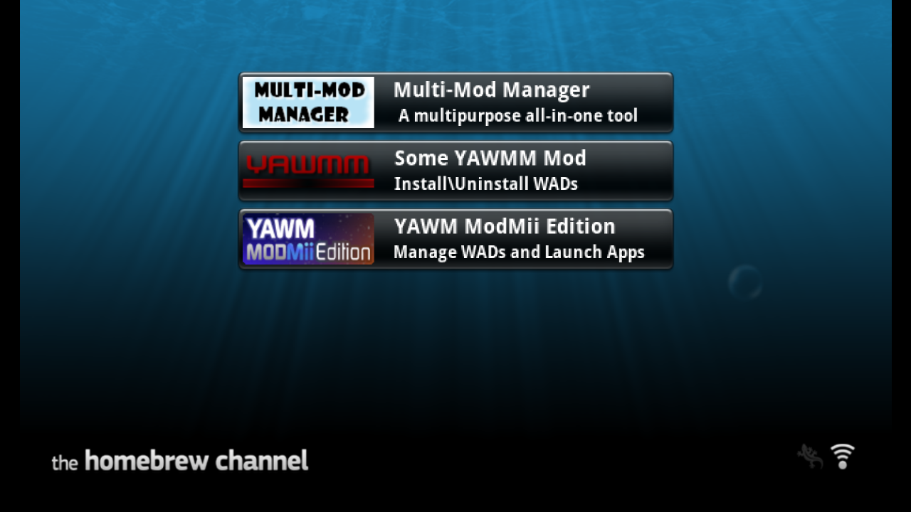

# FCE Ultra GX 频道一览


资源里的这些频道，使用的图片素材各有不同，但作用都是一样的，根据个人喜好，选择一个安装就好。

这些频道只是 APP 的快捷方式，并不包含 APP 的本体，点开频道之后，程序会依次在 SD 卡和 USB 设备的 apps 文件夹里找 APP 的本体，找到就启动 APP，找不到就返回。


## FCEUltraGX-Channel-Installer.zip

这个包是官方提供的频道安装器，它是一个 APP。

使用步骤：

第 1 步，解压到 SD 卡或者 USB 设备的根目录。以 SD 卡为例，正确解压后，在 apps 文件夹里会多出一个名为 fceugx-channel-installer 的文件夹：

```
💾SD 卡:
 ┣ 📂apps
 ┃  ┗ 📂fceugx-channel-installer 
 ┗ readme.txt
```

第 2 步，在 HBC 中启动频道安装器 APP，按照提示操作，即可完成频道的安装：


第 3 步，安装成功后，即可直接通过 Wii 频道来启动 FCE Ultra GX。界面效果如下：

| Icon | Banner |
| :---: | :---: |
|  |  |


## .wad 格式的频道安装文件

安装步骤：

第 1 步，拷贝到 SD 卡或者 USB 设备的 wad 文件夹里。以 SD 卡为例：

```
💾SD 卡:
 ┗ 📂wad
    ┣ 📜FCEU GX [FCEU].wad
    ┣ 📜FCE Ultra GX [FCEU].wad
    ┗ 📜Nintendo [FCEU].wad
```

或者

```
💾SD 卡:
 ┗ 📂wad
    ┗ 📂FCE Ultra GX
       ┣ 📜FCEU GX [FCEU].wad
       ┣ 📜FCE Ultra GX [FCEU].wad
       ┗ 📜Nintendo [FCEU].wad
```

都可以。

第 2 步，在 Wii 上面完成 .wad 文件的安装。能够用来安装 .wad 文件的 APP 多了去了，下图是常用的几款：



再次强调，资源里的这些频道，只是使用的图片素材各有不同，作用都是一样的，根据个人喜好，选择一个安装就好。以下为各个 .wad 文件安装后的频道界面效果：

### FCEU GX [FCEU].wad


### FCE Ultra GX [FCEU].wad


### Nintendo [FCEU].wad


