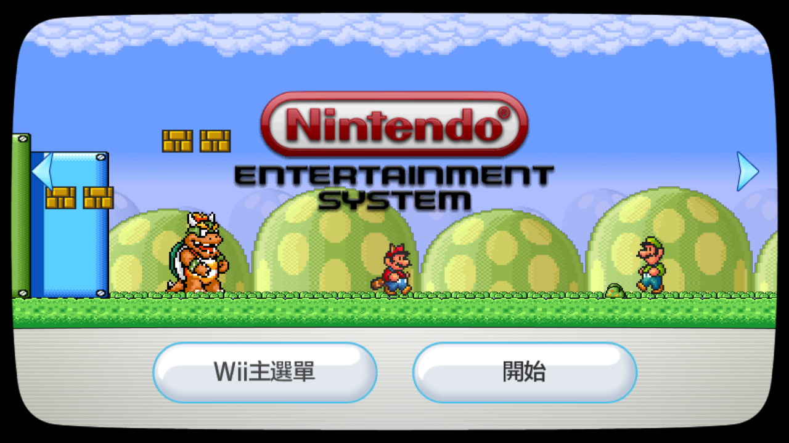

# FCE Ultra GX 频道一览


## 一、FCEUltraGX-Channel-Installer.zip

官方提供的频道安装器是一个独立 APP。

使用步骤：

第 1 步，解压到 SD 卡或者 USB 设备的根目录。以 SD 卡为例，正确解压后，在 apps 文件夹里会多出一个名为 fceugx-channel-installer 的文件夹：

```
💾SD 卡:
 ┣ 📂apps
 ┃  ┗ 📂fceugx-channel-installer 
 ┗ readme.txt
```

第 2 步，在 HBC 中启动频道安装器 APP，按照提示操作，即可完成频道的安装：


第 3 步，安装成功后，即可直接通过 Wii 频道来启动 FCE Ultra GX。界面效果如下：

| Icon | Banner |
| :---: | :---: |
|  |  |


## 二、FCEU GX [FCEU].wad

这个频道安装文件使用的素材来自于官方提供的频道，以下为安装后的界面效果：


## 三、FCE Ultra GX [FCEU].wad


## 四、Nintendo [FCEU].wad




