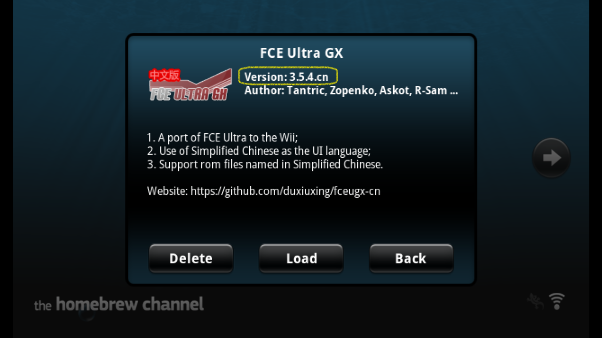

# FCE Ultra GX 简体中文版简介


FCE Ultra GX 是 Wii 上面著名的任天堂红白机模拟器，目前最新的[官方版本](http://wiibrew.org/wiki/FCE_Ultra_GX)为 3.5.4，默认界面语言为英文。

R-Sam 在开源项目的基础上制作了它的简体中文版本。在[下载页面](https://github.com/duxiuxing/fceugx-cn/releases)中，简体中文版的资源主要包含以下几个部分：

1. APP 的本体：FCEUltraGX-v3.5.4.cn.zip
2. 背景音乐：bg_music.ogg
3. 导入游戏：Sample-FCEUltraGX-cn.zip
4. APP 的快捷方式：Wii 频道


## FCEUltraGX-v3.5.4.cn.zip

这个包是简体中文版 APP 的本体。

使用步骤：

第 1 步，解压到 SD 卡或者 USB 设备的根目录。以 SD 卡为例，正确解压后，目录结构如下：

```
💾SD 卡:
 ┣ 📂apps
 ┃  ┗ 📂fceugx
 ┃     ┣ 📜boot.dol
 ┃     ┣ 📜icon.png
 ┃     ┗ 📜meta.xml
 ┗ 📂fceugx
```

- apps > fceugx 文件夹，简称 APP 文件夹。APP 文件夹里面包含了 APP 的可执行文件（boot.dol）、图标文件（icon.png）和描述文件（meta.xml）。
- 根目录的 fceugx 文件夹，简称数据文件夹。数据文件夹里面的内容，在后面导入游戏的部分有进一步说明。

第 2 步，在 HBC 中启动 APP：




## bg_music.ogg

这个是 APP 的背景音乐文件。把它拷贝到 APP 文件夹即可：

```
💾SD 卡:
 ┗ 📂apps
    ┗ 📂fceugx
       ┗ 📜bg_music.ogg
```

有没有背景音乐文件并不影响使用 APP 玩游戏，属于锦上添花的功能。如果你想把 APP 的背景音乐换成自己喜欢的音乐或者歌曲，需要注意以下两点：

1. 背景音乐文件的格式和文件名都是固定的，不能更改；
2. APP 加载背景音乐文件的时候会占用内存，因此音乐文件的体积不宜太大。


## Sample-FCEUltraGX-cn.zip

在这个包里面，我按照 APP 数据文件夹的目录结构，放了一个红白机游戏和它对应的三种预览图：

```
💾SD 卡:
 ┗ 📂fceugx
    ┣ 📂artwork
    ┃  ┗ 📜古巴战士(中).png
    ┣ 📂covers
    ┃  ┗ 📜古巴战士(中).png
    ┣ 📂roms
    ┃  ┗ 📜古巴战士(中).nes
    ┗ 📂screenshots
       ┗ 📜古巴战士(中).png
```

- 游戏的 ROM 文件放在 roms 文件夹，支持 .nes 和 .zip 两种格式；
- .png 格式的预览图不是必须的，有没有预览图并不影响使用 APP 玩游戏；
- 图片和 ROM 的文件名必须一样才能匹配，图片的长宽不得超过 640x480。

按 Wii 遥控器手柄的 [+] 键可以切换预览图类型：

artwork 文件夹是插图目录，下图为游戏插图展示：


covers 文件夹是封面目录，下图为游戏封面展示：


screenshots 文件夹是截图目录，下图为游戏截图展示：


## Wii 频道

详情见[《FCE Ultra GX 频道一览》](../channel/doc/README.md)。
